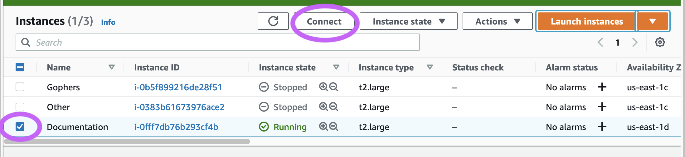

------------------------------
Setting up an EC2 Augur Server
------------------------------

EC2 Server Configuration
------------------------
1. Initially you must sign up or login to your AWS account.
2. Navigate to the EC2 instance dashboard.
3. Click on the Launch instances button
.. image:: ec2-images/launch_instances.png
  :width: 400
  :alt: Launch instances button
4. Choose your Amazon Machine Image
  - Recommended image: Ubuntu Server 20.02 LTS
5. Choose an instance type
  - Recommended instance type: t2.large
6. Click next to configure instance details, make no changes to this and click next again to add storage
7. Add atleast 20 GiB of storage to the Root volume
8. Click next and then make no changes and click next again
9. Configure Security Group
  - Unsecure option: open all ports:

  - Here we need to create another option that is more secure for the final part of the project
10. Review and launch the instance
  - Create a keypair here and make sure to save it in a secure location.

Connecting to your EC2 Server
-----------------------------
1. Select your instance (make sure the checkmark on the left side of the instance panel is checked)
2. Navigate to Connect

3. Copy the provided example and navigate to your systems terminal
4. Change into the directory with your keypair
5. Paste the command into terminal and confirm by typing 'yes' when prompted

Augur Setup
-----------
1. PostgreSQL Installation and configuration
.. code-block:: bash
  sudo apt update
  sudo apt upgrade
  sudo apt install software-properties-common
  sudo apt install python3-dev
  sudo apt install postgresql postgresql-contrib postgresql-client
  sudo apt install build-essential

2. Create a PostgreSQL database for Augur
.. code-block:: bash
  sudo su -
  su - postgres
  psql

3. Configure the database
.. code-block:: postgresql
  postgres=# CREATE DATABASE augur;
  postgres=# CREATE USER augur WITH ENCRYPTED PASSWORD 'password';
  postgres=# GRANT ALL PRIVILEGES ON DATABASE augur TO augur;

4. Git Configuration
.. code-block:: bash
  git config --global diff.renames true
  git config --global diff.renameLimit 200000
  git config --global credential.helper cache
  git config --global credential.helper 'cache --timeout=9999999999999'

5. Go installation
.. code-block:: bash
  sudo apt update
  sudo apt install snapd
  sudo snap install go --classic

6. Python Virtual Environment Configuration
.. code-block:: bash
  git clone https://github.com/<YOUR_GITHUB_USERNAME>/augur.git
  cd augur/
  sudo apt install make
  sudo apt-get install python3-venv
  python3 -m venv $HOME/.virtualenvs/augur_env
  source $HOME/.virtualenvs/augur_env/bin/activate
  sudo apt install python-pip-whl
  sudo apt install python3-pip
  sudo apt install pythonpy
  python -m pip install --upgrade pip
  make install-dev

Nagvigating Augur
----------------
1. Commands for loading repositories
.. code-block:: bash
  augur db add-github-org
  augur db add-repo-groups
  augur db add-repos
